# Projects from DevClub Course

This repository contains seven small Css/Html projects made during the front-end course on DevClub.
Check the Projects [HERE](https://patriciazan.github.io/DevClub-Projetos/)

Main Page
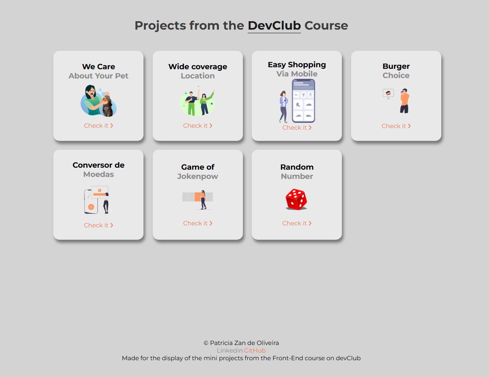
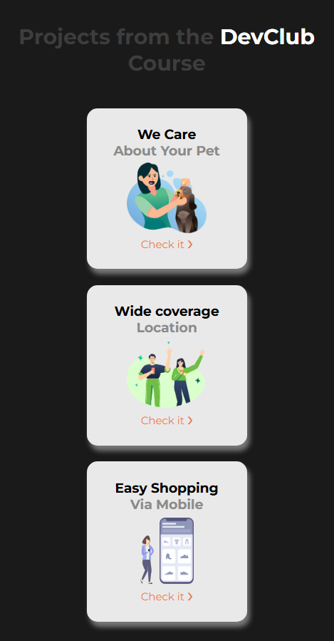

First project  - We care about your pet.
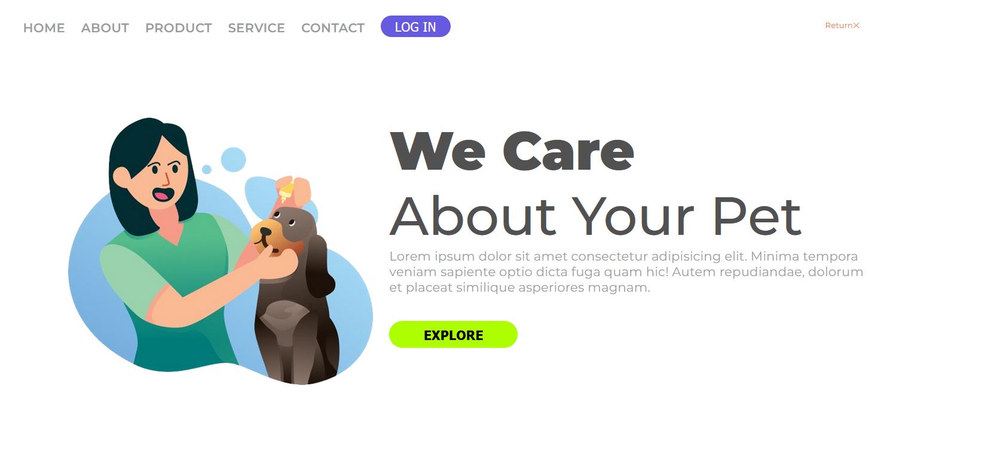
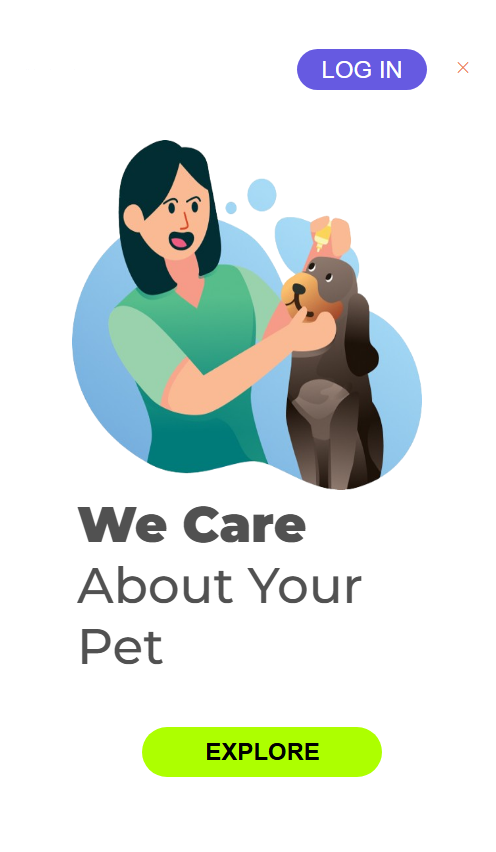

Second project - Wide coverage Location.
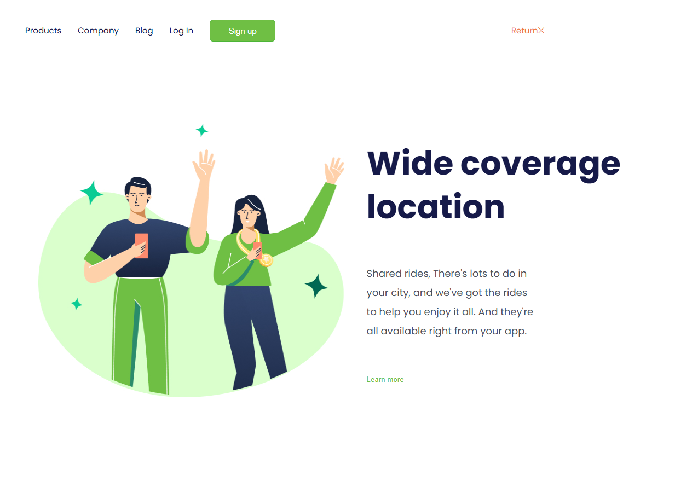
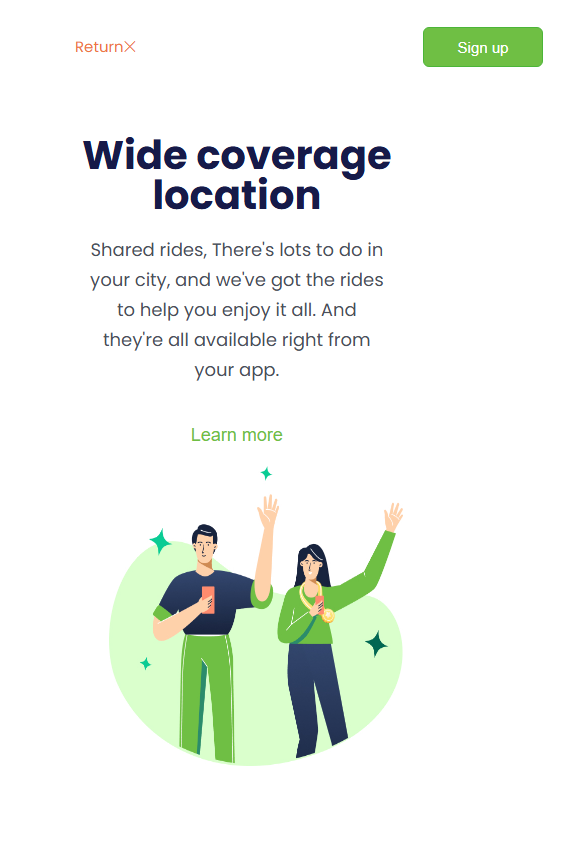

Third project  - Easy Shopping Via Mobile.
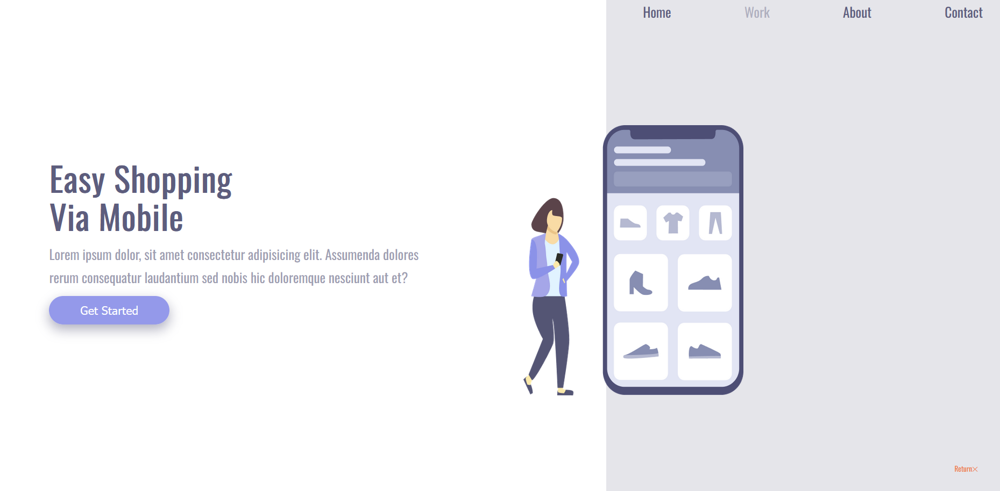
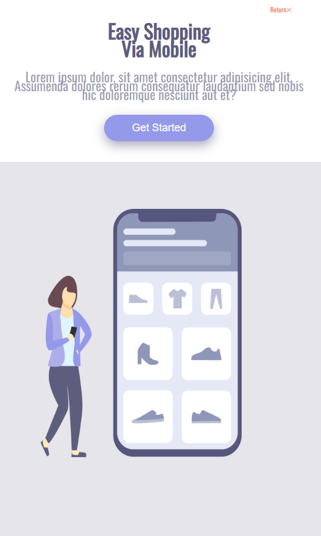

Fourth Project - Burgers
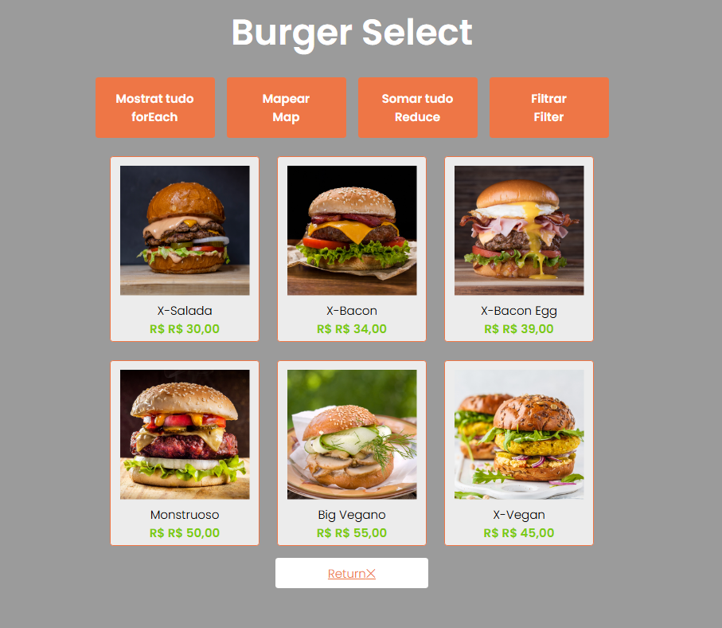

Fifth Project - Currency Converter
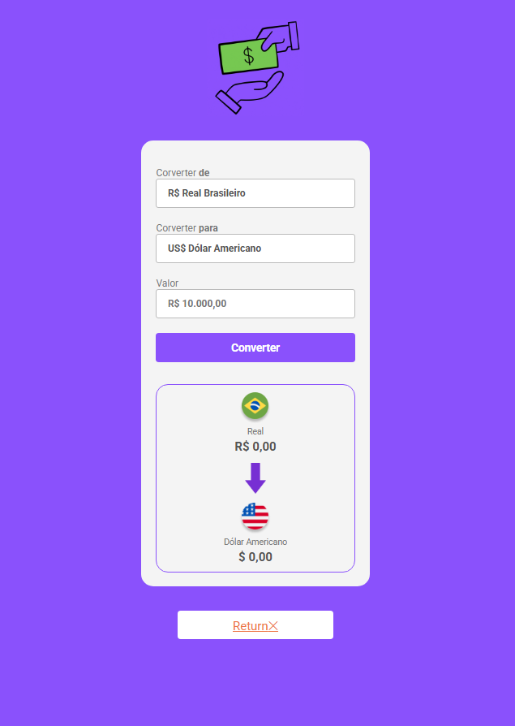

Sixth Project - JokenpowGame
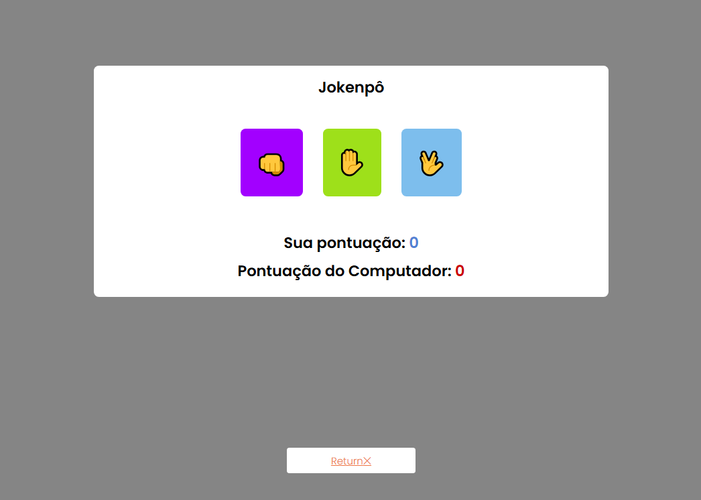

Seventh Project - Random Number
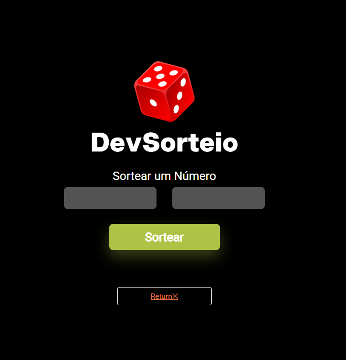
